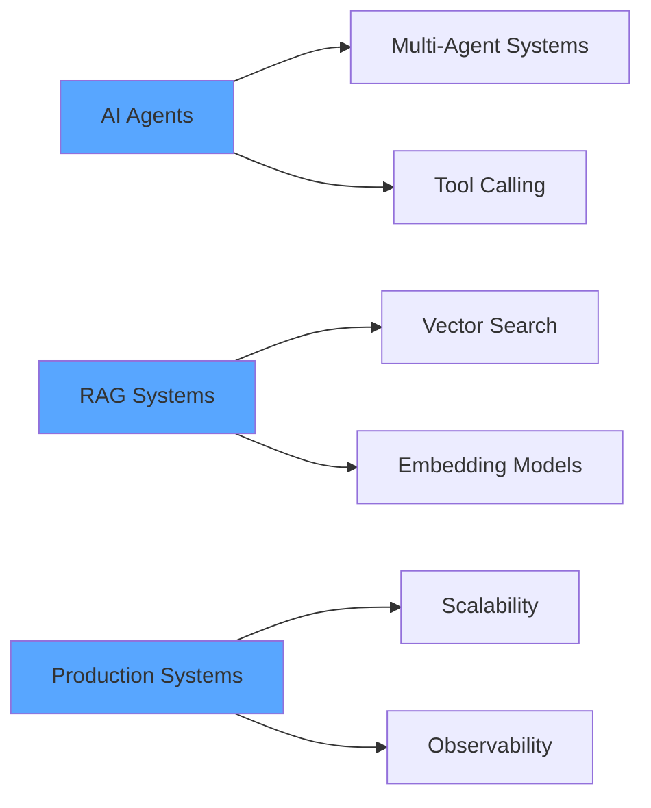

<div align="center">

<!-- Animated Header -->


<!-- Typing Animation -->


<!-- Social Badges -->
<p>
  <a href="mailto:mrinalmanna2004@gmail.com">
    
  </a>
  <a href="https://www.linkedin.com/in/mrinal-manna/" target="_blank">
    
  </a>
  <a href="https://portfoliomrinal.netlify.app/" target="_blank">
    
  </a>
  <a href="https://github.com/mrinal-manna" target="_blank">
    
  </a>
</p>

<!-- Visitor Badge & Profile Views -->
<p>
  
  
</p>

</div>

---

## 🚀 About Me

```typescript
const mrinalManna = {
    location: "Balasore, India 🇮🇳",
    education: "B.Tech CSE @ BCET | GPA: 8.5/10",
    currentRole: "Software Engineer Intern @ Wizible AI",
    previousRole: "Software Engineer Intern @ Knugget AI",
    
    workingOn: ["AI Pipelines", "RAG Systems", "Multi-Model Integration"],
    learning: ["AI Agents", "LangChain", "Vector Databases"],
    
    achievements: {
        hackathonWins: 3,
        chromeExtensionUsers: "1K+",
        projectUsers: "50+",
        dsaProblems: "300+"
    },
    
    funFact: "Night's Watch cloaks in Game of Thrones were made from IKEA rugs! 🛋️"
};
```

<div align="center">

### 💼 Professional Experience

</div>

<table>
<tr>
<td width="50%" valign="top">

#### 🔷 Wizible AI (Current)
**Software Engineer Intern** | *July 2025 - Present*

- 🤖 Built multi-model AI pipelines (OpenAI, Claude, Gemini, LlamaIndex)
- ⚡ Processing 100+ concurrent files with batch orchestration
- 🔐 TypeScript/Express backend with secure uploads
- 📊 Dynamic Supabase tables for large-scale data

</td>
<td width="50%" valign="top">

#### 🔷 Knugget AI
**Software Engineer Intern** | *May 2025 - July 2025*

- 🎯 Shipped GPT-powered Chrome extension (1K+ installs)
- 🔧 Production-grade REST APIs with JWT/Firebase auth
- 💳 Credit-based usage system with rate limiting
- 📈 Built analytics pipelines for user insights

</td>
</tr>
</table>

---

## 🛠️ Tech Arsenal

<div align="center">

### Languages & Core Technologies
<p>
  
</p>

### Frontend Development
<p>
  
</p>

### Backend & Databases
<p>
  
</p>

### AI & Machine Learning
<p>
  
  
  
  
  
  
</p>

### DevOps & Tools
<p>
  
</p>

</div>

---

## 🎯 Featured Projects

<div align="center">

<table>
<tr>
<td width="50%" valign="top">

### 🌟 [RepoFlow AI](https://repoflow.vercel.app/)
[](https://github.com/mrinal-manna/repoflow-ai)
[](https://repoflow.vercel.app/)

**RAG-Powered GitHub Analytics Platform**

🔹 AI commit/PR summarization using OpenAI  
🔹 Semantic search with Supabase vectors  
🔹 Interactive repo visualization  
🔹 **50+ early users**

**Tech:** Gemini AI, NeonDB, Next.js, tRPC, PostgreSQL

</td>
<td width="50%" valign="top">

### ✨ [Sketch2Code AI](https://sketch2-code.vercel.app/)
[](https://github.com/mrinal-manna/sketch2code)
[](https://sketch2-code.vercel.app/)

**Sketch-to-JSX Conversion Pipeline**

🔹 Hand-drawn UI → Tailwind JSX (85% fidelity)  
🔹 Edge deployment with 20% latency reduction  
🔹 Credit-gated onboarding system  
🔹 Real-time preview generation

**Tech:** Next.js, Firebase, DeepSeek, Vercel, Drizzle ORM

</td>
</tr>
</table>

</div>

---

## 🏆 Achievements & Recognition

<div align="center">


</div>

<table>
<tr>
<td width="33%" align="center">

### 🥇 BPUT Hackathon 2024
**₹30,000 Prize**

AI-powered supply chain + carbon tracking dashboard

</td>
<td width="33%" align="center">

### 🥇 InnovateX 2025
**₹15,000 Prize**

Real-time disaster response tool using WebXR

</td>
<td width="33%" align="center">

### 🥈 Trithon 2025
**₹3,000 Prize**

Built advanced analytics dashboard

</td>
</tr>
</table>

<div align="center">

#### 🎓 Leadership & Mentorship

**IoT Workshop Mentor** | Trained 40+ students across St. Xavier's & JNV schools  
**Event Organizer** | Led Coding Ninjas campus outreach, 2x engagement boost

</div>

---

## 📊 GitHub Analytics

<div align="center">


<!-- Activity Graph -->


</div>

---

## 🐍 Contribution Snake

<div align="center">

<picture>
  <source media="(prefers-color-scheme: dark)" srcset="https://raw.githubusercontent.com/mrinal-manna/mrinal-manna/output/github-snake-dark.svg" />
  <source media="(prefers-color-scheme: light)" srcset="https://raw.githubusercontent.com/mrinal-manna/mrinal-manna/output/github-snake.svg" />
  
</picture>

</div>

---

## 💡 Current Focus



<div align="center">

### 📈 Skills Progress

| Skill | Experience |
|-------|------------|
| Full-Stack Development | ███████████████████░ 95% |
| AI/ML Integration | ██████████████████░░ 90% |
| Backend Architecture | ████████████████████ 88% |
| DevOps & Cloud | ███████████████░░░░░ 75% |
| System Design | ██████████████░░░░░░ 70% |

</div>

---

## 📫 Let's Collaborate!

<div align="center">

**I'm always open to:**
- 🚀 Innovative AI/ML projects
- 💡 Full-stack development opportunities
- 🤝 Open source collaborations
- 🎯 Hackathons and competitions

### 📧 Reach me at: [mrinalmanna2004@gmail.com](mailto:mrinalmanna2004@gmail.com)


</div>

---

<div align="center">

**⭐ From [mrinal-manna](https://github.com/mrinal-manna) | Last Updated: December 2025**

</div>