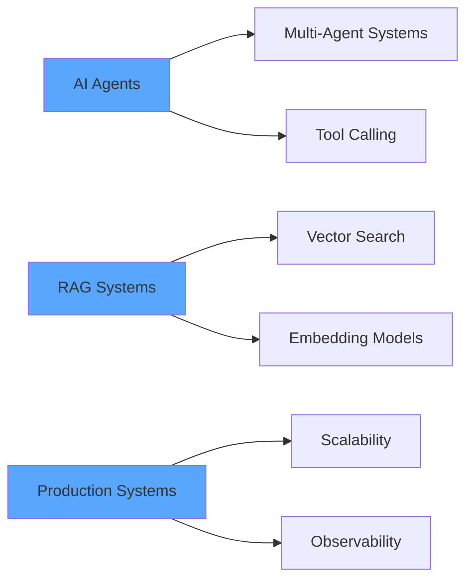

<div align="center">

<!-- Animated Header -->


<h1>Mrinal Manna</h1>
<h3>🚀 Building AI-Powered Solutions</h3>
<p>
  <b>Full-Stack Developer | GenAI Engineer</b><br>
  RAG Pipelines • Scalable Backends • Chrome Extension (1K+ Users) 🌟
</p>

<!-- Social Badges -->
<p>
  <a href="mailto:mrinalmanna2004@gmail.com">
    
  </a>
  <a href="https://www.linkedin.com/in/mrinal-manna/" target="_blank">
    
  </a>
  <a href="https://portfoliomrinal.netlify.app/" target="_blank">
    
  </a>
  <a href="https://github.com/mrinal-manna" target="_blank">
    
  </a>
</p>

<!-- Visitor Badge & Profile Views -->
<p>
  
  
</p>

</div>

---

## 🚀 About Me

```typescript
const mrinalManna = {
  location: "Balasore, India 🇮🇳",
  education: "B.Tech CSE @ BCET | GPA: 8.5/10",
  currentRole: "Software Engineer Intern @ TorchKB AI",

  workingOn: ["AI Pipelines", "RAG Systems", "Multi-Model Integration"],
  learning: ["AI Agents", "LangChain", "Vector Databases"],

  achievements: {
    hackathonWins: 3,
    chromeExtensionUsers: "1K+",
    projectUsers: "50+",
    dsaProblems: "300+",
  },

  funFact:
    "Night's Watch cloaks in Game of Thrones were made from IKEA rugs! 🛋️",
};
```

<div align="center">

### 💼 Professional Experience

</div>

<table>
<tr>
<td width="100%" valign="top">

#### 🔷 TorchKB AI — Bangalore, India

**Software Engineer Intern** | _July 2025 - Present_

- 🌐 **Cross-Platform Chrome Extension:** Shipped a production Chrome extension using content scripts, background service workers, and OAuth — enabling AI-powered summarization across YouTube, LinkedIn, and web pages
- ⚙️ **Scalable Backend & Email Automation:** Engineered REST APIs and webhook-driven subscription workflows with validation and error handling; automated personalized weekly email digests for paid users
- 🧠 **AI Processing & Token Management:** Designed token-aware AI processing pipelines with transcript chunking (100K+ chars), tier-based limits, billing-cycle automation, and usage monitoring

</td>
</tr>
</table>

---

## 🛠️ Tech Arsenal

<div align="center">

### Languages & Core Technologies

<p>
  
</p>

### Frontend Development

<p>
  
</p>

### Backend & Databases

<p>
  
</p>

### AI & Machine Learning

<p>
  
  
  
  
  
  
</p>

### DevOps & Tools

<p>
  
</p>

</div>

---

## 🎯 Featured Projects

<div align="center">

<table>
<tr>
<td width="50%" valign="top">

### 🌟 Rigorus AI

[](https://github.com/mrinal-manna)
[](#)

**AI Council & Decision Engine**

🔹 Multi-model orchestration across **10+ LLMs**  
🔹 Parallel querying with structured synthesis  
🔹 **~40% reduction** in single-model bias  
🔹 Usage-based billing with BigInt precision & SSE streaming

**Tech:** Next.js, OpenRouter, PostgreSQL, DodoPayments, Firebase

</td>
<td width="50%" valign="top">

### ✨ [RepoFlow AI](https://repoflow.vercel.app/)

[](https://github.com/mrinal-manna/repoflow-ai)
[](https://repoflow.vercel.app/)

**RAG-Powered GitHub Analytics Platform**

🔹 RAG-based system using vector search  
🔹 AI commit & PR summarization  
🔹 Semantic search + interactive repo visualization  
🔹 **50+ early users onboarded**

**Tech:** Gemini AI, NeonDB Vector DB, Next.js, tRPC, PostgreSQL

</td>
</tr>
<tr>
<td colspan="2" valign="top">

### 🧩 SystemCraft — AI-Powered System Design Mentor

[](https://github.com/mrinal-manna)
[](#)

**AI-Driven System Design Analysis Engine**

🔹 Hybrid rule-based + LLM architecture checker that detects missing production patterns (caching, scaling, security)  
🔹 Generates contextual, interview-ready improvement suggestions  
🔹 "Git for System Design" — auto-detects resolved architectural gaps with full version history  
🔹 Dynamic maturity scores (0–5) tracking design progression over time

**Tech:** FastAPI, Next.js, PostgreSQL, OpenRouter, Redis

</td>
</tr>
</table>

</div>

---

## 🏆 Achievements & Recognition

<div align="center">


</div>

<table>
<tr>
<td width="33%" align="center">

### 🥇 BPUT Hackathon 2024

**₹30,000 Prize**

AI-powered supply chain + carbon tracking dashboard

</td>
<td width="33%" align="center">

### 🥇 InnovateX 2025

**₹15,000 Prize**

Real-time disaster response tool using WebXR

</td>
<td width="33%" align="center">

### 🥈 Trithon 2025

**₹3,000 Prize**

Built advanced analytics dashboard

</td>
</tr>
</table>

<div align="center">

#### 🎓 Leadership & Mentorship

**IoT Workshop Mentor** | Trained 40+ students across St. Xavier's & JNV schools  
**Event Organizer** | Led Coding Ninjas campus outreach, 2x engagement boost

</div>

---

## 📊 GitHub Analytics

<div align="center">


<!-- Activity Graph -->


</div>

---

## 🐍 Contribution Snake

<div align="center">

<picture>
  <source media="(prefers-color-scheme: dark)" srcset="https://raw.githubusercontent.com/mrinal-mann/mrinal-mann/output/github-snake-dark.svg" />
  <source media="(prefers-color-scheme: light)" srcset="https://raw.githubusercontent.com/mrinal-mann/mrinal-mann/output/github-snake.svg" />
  
</picture>

</div>

---

## 💡 Current Focus


```mermaid
graph LR
    A[AI Agents] --> B[Multi-Agent Systems]
    A --> C[Tool Calling]
    D[RAG Systems] --> E[Vector Search]
    D --> F[Embedding Models]
    G[Production Systems] --> H[Scalability]
    G --> I[Observability]

    style A fill:#58a6ff
    style D fill:#58a6ff
    style G fill:#58a6ff
```

<div align="center">

### 📈 Skills Progress

| Skill                  | Experience               |
| ---------------------- | ------------------------ |
| Full-Stack Development | ███████████████████░ 95% |
| AI/ML Integration      | ██████████████████░░ 90% |
| Backend Architecture   | ████████████████████ 88% |
| DevOps & Cloud         | ███████████████░░░░░ 75% |
| System Design          | ██████████████░░░░░░ 70% |

</div>

---

## 📫 Let's Collaborate!

<div align="center">

**I'm always open to:**

- 🚀 Innovative AI/ML projects
- 💡 Full-stack development opportunities
- 🤝 Open source collaborations
- 🎯 Hackathons and competitions

### 📧 Reach me at: [mrinalmanna2004@gmail.com](mailto:mrinalmanna2004@gmail.com)


</div>

---

<div align="center">

**⭐ From [mrinal-manna](https://github.com/mrinal-manna) | Last Updated: May 2026**

</div>
